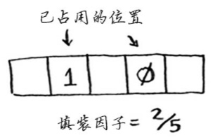

* 学习散列表 -- 最有用的基础数据结构之一;
* 学习散列表的内部机制: 实现、冲突和散列函数。

超市的售货员查找产品价格例子:

* 新的售货员会在小本子(无顺记录的)里一行行查找;
* 有经验的可以在小本子(有序记录的)里二分法查找;
* 高级店长可以记住所有价格，不需要查找，麻烦知道;


从数据结构来看，以上就是三种数据结构: 数组(二分法查询)、链表和散列表。

下面先说说散列函数。

## 散列函数

散列函数就是“将输入映射到数字”:


看起来没什么规律，但其实散列函数必须满足下面两个要求:

* **必须**是一致的。Hash(apple)=4的话，那么每次输入'apple'，得到的永远是4。
* **应该**将不同的输入映射到不同的数字。例如，Hash(apple)=4; Hash(Milk)=2... 如果返回的数字都是一样的，这不是一个好的散列函数。最理想情况，所有不同的输入映射到不同的数字。(注: 哈希碰撞)

打造你的“高级店长”:

```python3
>>> price_list = dict()
>>> price_list["apple"] = 0.67
>>> price_list["milk"] = 1.47
>>> price_list["avocado"] = 1.49
>>> ...
>>> print(price_list)
{'apple': 0.67, 'milk': 1.47, 'avocado': 2}
>>> print(price_list["avocado"])
1.49
```

假如你需要知道‘avocado’的价格，通过散列函数得到 4。


然后在价格列表找到`index = 4`的价格，为1.49。


为什么散列函数能够准确地指出价格的储存位置?

* 散列函数**总是**将相同的输入映射到相同的索引。每次输入'avocado'都输出`4`;
* 散列函数将不同的输入映射到不同的索引。
* 散列函数知道数组的大小，只返回有效的索引。

这样，你结合使用`散列函数`和`数组`打造了`散列表`。

## 应用场景

### 用于查找

* 手机通讯录

```python
>>> phone_book = dict()
>>> phone_book["jenny"] = 8675309
>>> phone_book["jack"] = 82273321
>>> print(phone_book["jenny"])
8675309
```

* DNS的解析: 你输入域名(google.com)访问相应网址是，DNS将其转为IP地址。


### 防止重复

假如你要制作个投票系统，每人只能投一票，如何防止重复投票?

你可以保存一个长长的`已投票名单列表`，每次有人来投票，都先检查一下是否已经登记到`已投名单`中。

但名单太长，你每次浏览以确定是够重复投票，效率很低。

有一种更好的办法 -- 使用散列表!

```python
voted = {}


def check_voter(name):
    if voted.get(name):
        print("kick it out!")
    else:
        voted[name] = True
        print("let it vote!")


if __name__ == "__main__":
    check_voter("tom")
    check_voter("tom")
    check_voter("jack")
```

散列表相比名单列表的优势:

当名单变得很长时，列表查询会变得很慢 -- 必须查找搜索整个列表；而使用散列来检查，速度非常快。

### 缓存

当你访问`facebook.com`，

* 向Facebook服务器发送请求
* 服务器做些处理，生成一个网页并将其发送给你
* 浏览器展示这个网页

每次服务器处理需要几秒钟时间，作为用户觉得Facebook这么慢！其实，Facebook的服务器在努力工作，要支撑数亿用户的访问，每个用户的方位累加起来就相当忙了。假如你是Facebook的工程师，有没有办法让服务器减少工作，从而提高Facebook的访问速度？

> 衍生例子: 好问的侄女
> 你的侄女总是问你问题，比如火星有多远？月球呢？你每次都去google.com查找答案，然后回答侄女，这样要花几分钟。假如她老是你同样的问题 -- 月球有多远？你很快就记住了238900英里，就不用去google 搜索了，直接告诉她就好。这就是缓存的工作原理。

现在，你可以将常规的Facebook页面(主页、About页面等)缓存，在用户需要的时候直接发送给他，以减少服务器的处理访问。

```python
cache = {}


def get_page(url):
    if cache.get(url):
        return cache[url]
    else:
        data = get_data_from_server(url)
        cache[url] = data
        return data
```

仅当URL不在缓存中，才让服务器处理，同时处理得到的数据保存至缓存，在返回。

## 冲突与填装因子

> 散列函数**可能**将不同的键值映射到相同的索引

### 冲突

回到`杂货店的价格表`问题，假设散列表的数组有26个位置。

而散列函数很简单，按首字母顺序分配位置: A=0; B=1; C=2...


你先记录“apple”的价格，然后要记录"avocado"价格，这时分配的都是第一个问题。


这就产生了冲突(collision): 两个键值分配了相同的位置。处理冲突常用的方式是，使用链表。


那假如录入的商品都是'a'开头呢，


这个散列表中的所有元素都储存在一个链表中，这与将所有元素用一个链表储存是一样糟糕的，查询会很慢。

所有，

* 散列函数很重要。最理想的情况是，散列函数将所有键值均匀分配到散列表的不同位置。
* 好的散列函数可以减少冲突，以提高查询的性能。

下面比较散列表同数组和链表的性能比较:


在平均情况下，散列表的查找与在数组(给定索引)查找一样快，而插入和删除与链表一样。但最糟糕情况下，散列表的所有操作都很慢。因此，使用散列表时要避开最糟糕的情况，需要避免冲突。而避免冲突，需要:

* 较低的填装因子；
* 良好的散列函数。

### 填装因子

散列表的填装因子计算公式: 元素数量 / 位置总数。

下面的散列表的填装因子是 2/5，即0.4。



填装因子越低，发生冲突的可能性越小，散列表的性能越高。一般的推荐因子是0.7，一旦大于这个数字，就调整散列列表的长度。但是调整长度的开销很大，不应该频繁的调整。

## 总结

* 可以使用散列函数和数组来创建散列表
* 冲突很糟糕，因最大限度减少冲突
* 散列表的查询、插入和删除速度非常快
* 散列表适用于映射关系维护、防止重复和缓存数据
* 填装因子超过0.7时，就要调整散列表的长度