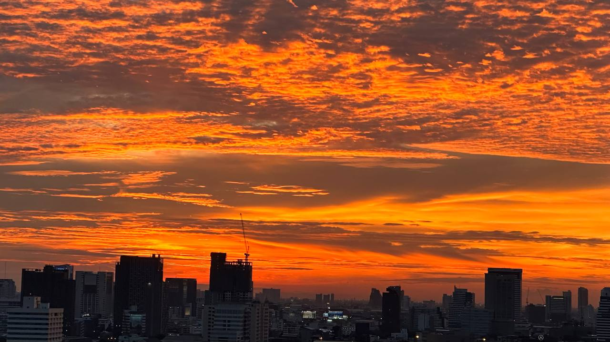
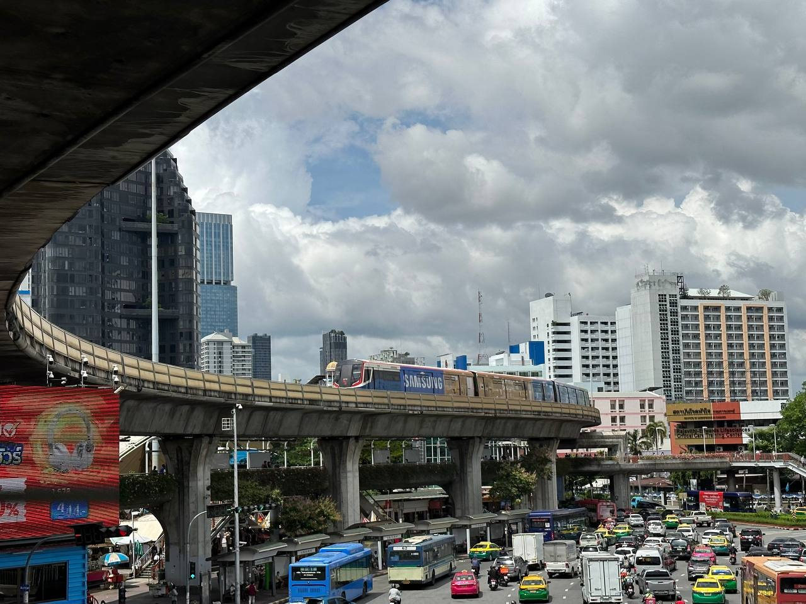
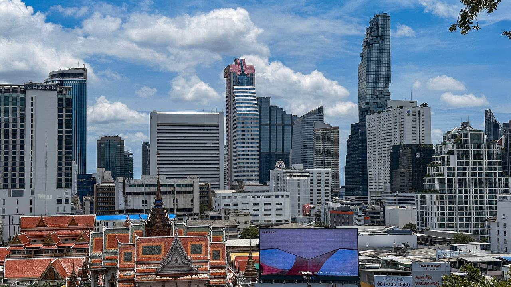
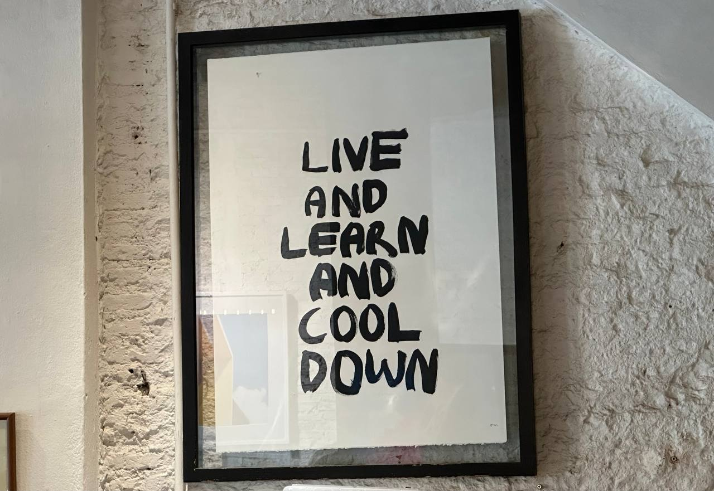

12月还剩下2天，趁着记忆还未消散，还有余温，写点文字记录这一年的总结复盘吧。

整体上，23年不算太顺利，但在泰国工作生活一年了，让我觉得不可思议，让我这一年很快乐，是这一年最重要的一点 -- 如果缺失快乐，在生活中遇到的各种问题: 挣不到钱，孤独，人生方向在哪里... 会让人更加迷茫，但我可以找到自己的快乐，享受生活，过日子就容易多了。

1. 我喜欢把事情简化，把事情的结果量化，不相信各种理由。这一年跑步就是少了，几乎停了下来，累计跑步只有300公里(22年是1200公里)，别给自己找借口了，24年跑就是了。比较庆幸的是在7月份完赛了一场越野赛，最让我失望的是，中了新冠(首羊)而错过了曼谷马拉松。

2. 生活环境变了，生活环境其实没变。不要总想着“换个环境，我就会变的”，就像我生活到美国，英语肯定变好: ) ... 变化是有的，但本质生活呢？没有变化，依然是两点一线，一日三餐，周末遛娃。思维方式决定了生活方式，在国内的生活惯性依然影响着我的日常生活，所以不要指望换个城市/国家来让生活变得不一样了。

3. 依然在培养一个输出型的爱好，想给你一些帮助，甚至影响到你，那样我觉得很有成就感。因为生活在泰国，让我更加容易的去体验泰国，不需要请假来了。这一年，我开通了小红书(id: 120115938) - 李木木，记录了在泰国的吃喝玩乐，一方面记录我的快乐，另方面把我的快乐延续到更多的人。

4. 坚持多阅读，不挑环境，不错过碎片时间，见缝插针。微信读书真的太好用了，尤其人住国外，买不到也买不起很多书，通过微信读书的总结，这一年读完21+书本，235+小时，让阅读成为一种生活习惯。

24年: 多阅读，多跑步，多笑笑，钱多多...
